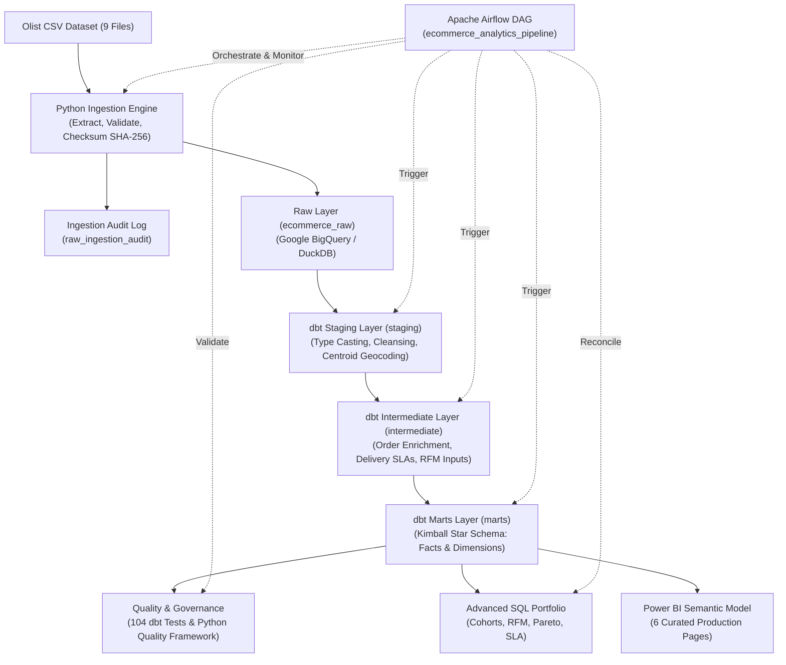
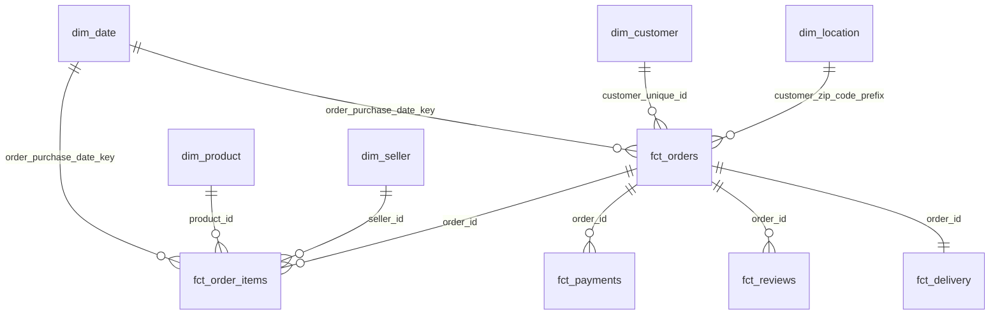

# E-Commerce Analytics Platform
### End-to-End ELT, Analytics Engineering, Data Modeling & Business Intelligence

[](https://www.python.org/)
[](https://www.getdbt.com/)
[](https://cloud.google.com/bigquery)
[](https://airflow.apache.org/)
[](https://powerbi.microsoft.com/)
[](https://pages.github.com/)
[]()
[]()

---

## Overview

The **E-Commerce Analytics Platform** is a production-grade portfolio project demonstrating how a Senior Analytics Engineer / Data Analyst designs, builds, and maintains an enterprise-level analytics system from raw landing to executive intelligence.

Built using the authentic **Brazilian E-Commerce Public Dataset by Olist** (100,000 orders, R$ 16M in transactions, 32,900 products, 3,000 sellers), this project adheres to strict separation of concerns across ingestion, cloud warehouse storage, dbt dimensional modeling, data quality testing, Apache Airflow DAG orchestration, advanced SQL analytics, and interactive Power BI semantic modeling.

---

## Business Problem

Modern multi-seller e-commerce marketplaces suffer from fragmented operational visibility. Commercial leads, logistics managers, and executive leaders struggle with:
1. **Uncertain Unit Economics**: Inability to separate merchandise revenue (GMV) from freight charges and understand category margins.
2. **Customer Retention Blindspots**: Lack of visibility into true customer acquisition cohorts, repeat purchase loyalty, and customer lifetime value (CLV).
3. **Logistics Fulfillment Delays**: Difficulty quantifying geographic transit bottlenecks, carrier SLA adherence, and their direct impact on customer satisfaction.
4. **Seller Concentration Risk**: Heavy reliance on a small tier of merchant sellers without systematic monitoring of merchant-level fulfillment reliability.

---

## Business Questions Answered

* **Commercial**: What are our historical GMV, order volume, and AOV growth trajectories? Which product categories drive the top 40% of marketplace revenue?
* **Customer Dynamics**: What is our true repeat purchase rate? How do customer acquisition cohorts retain over 12 months? How are buyers distributed across RFM segments?
* **Merchant Operations**: Which sellers maintain >=95% on-time fulfillment? Which merchant hubs drive the highest revenue volume?
* **Logistics & Delivery**: What is the nationwide average fulfillment duration (12.5 days) versus promised delivery SLA (24.5 days)? Which states experience the highest late delivery rates?
* **Customer Experience**: How severely do delivery delays degrade customer review ratings?

---

## Architecture

The system implements a decoupled modern data stack (MDS) architecture:



---

## Tech Stack

| Domain | Technology | Justification |
| :--- | :--- | :--- |
| **Language** | Python 3.11+ | Extensible ingestion pipeline, cryptographic hashing, contract validation with Pydantic, automated testing with Pytest. |
| **Cloud Warehouse** | Google BigQuery | Serverless petabyte-scale data warehouse with native partitioning, clustering, and BI Engine acceleration. |
| **Local Warehouse** | DuckDB 1.11+ | In-process columnar SQL database enabling 100% local reproduction and testing in seconds without cloud billing. |
| **Transformation** | dbt Core 1.11+ | Industry-standard SQL modeling framework providing lineage graphs, modular layering, and automated catalog documentation. |
| **Orchestration** | Apache Airflow 2.8+ | Enterprise DAG workflow orchestrator running in Docker Compose with automated retries and task observability. |
| **Business Intelligence** | Power BI | Star schema semantic model with explicit DAX measures and 6 purpose-built report pages. |
| **Testing** | pytest, dbt test | 104 dbt data and business rule tests, combined with unit tests for ingestion and financial reconciliation. |

---

## Dataset

This project utilizes the authentic **Brazilian E-Commerce Public Dataset by Olist**, consisting of 9 relational tables:
* `olist_orders_dataset.csv`: 99,441 order transaction records with purchase, dispatch, delivery, and estimated delivery dates.
* `olist_customers_dataset.csv`: 99,441 records containing `customer_id` and persistent `customer_unique_id`.
* `olist_order_items_dataset.csv`: 112,650 line-item records with prices, freight fees, product IDs, and seller IDs.
* `olist_order_payments_dataset.csv`: 103,886 payment transactions across credit cards, boletos, vouchers, and debit cards.
* `olist_order_reviews_dataset.csv`: 99,224 customer satisfaction survey reviews (ratings 1–5 and comments).
* `olist_products_dataset.csv`: 32,951 product SKUs with dimensions, weights, and Portuguese category names.
* `olist_sellers_dataset.csv`: 3,095 registered marketplace sellers with geographic locations.
* `olist_geolocation_dataset.csv`: 1,000,163 coordinate points mapped to 19,015 Brazilian zip code prefixes.
* `product_category_name_translation.csv`: 71 Portuguese-to-English product category mappings.

---

## Data Model

The dimensional model follows a **Kimball Star Schema** with conformed dimensions and single-direction cross-filtering:



### Table Grains & Key Definitions

* **`fct_orders`**: Grain is **one row per order transaction** (`order_id`). Holds consolidated financial measures (GMV, freight, total order value), payment summaries, review scores, and delivery flags.
* **`fct_order_items`**: Grain is **one row per order line item** (`order_item_key`). Tracks individual product unit prices, allocated freight, and shipping routes.
* **`fct_payments`**: Grain is **one row per payment tender attempt** (`payment_key`). Tracks installments and payment methods.
* **`fct_reviews`**: Grain is **one row per customer review submission** (`review_key`). Captures 1–5 star scores and survey response latency.
* **`fct_delivery`**: Grain is **one row per delivered order** (`order_id`). Tracks carrier dispatch time, transit duration, delay days, and on-time flags.
* **`dim_customer`**: Grain is **one row per persistent customer** (`customer_unique_id`). Contains lifetime spend, order count, and RFM behavioral segmentation.
* **`dim_product`**: Grain is **one row per catalog SKU** (`product_id`). Features English category classifications and volumetric freight sizing tiers.
* **`dim_seller`**: Grain is **one row per merchant** (`seller_id`). Contains lifetime revenue tiers and on-time SLA fulfillment percentages.
* **`dim_date`**: Grain is **one row per calendar day** (2016–2019). Marked as official Date Table.
* **`dim_location`**: Grain is **one row per Brazilian zip code prefix** (`zip_code_prefix`), with average latitude/longitude centroids and Brazilian IBGE macro-regions.

---

## Data Pipeline (ELT)

The pipeline executes through four automated stages:
1. **Extract**: Inspects landing directory, verifies expected files, computes cryptographic **SHA-256 checksums** for audit traceability.
2. **Validate**: Checks schema contracts, verifies expected column existence, and audits primary key null constraints.
3. **Load**: Loads raw records into `ecommerce_raw` using BigQuery batch jobs or local embedded DuckDB. Records load metadata into `raw_ingestion_audit`.
4. **Transform**: Executes dbt models across Staging, Intermediate, and Marts layers.
5. **Reconcile**: Runs independent multi-layer reconciliation checking row counts, orphan records, and penny-accurate financial totals.

---

## dbt Transformation Layers

* **`models/staging/`** (Views): 9 models cleaning, casting, standardizing string casings, and deduplicating raw sources.
* **`models/intermediate/`** (Views): 6 reusable enrichment models (`int_orders_enriched`, `int_order_items_enriched`, `int_customer_orders`, `int_delivery_metrics`, `int_product_metrics`, `int_seller_metrics`).
* **`models/marts/`** (Physical Tables): 5 dimension tables, 5 fact tables, and 4 aggregated summary marts (`mart_sales_monthly`, `mart_customer_retention`, `mart_seller_performance`, `mart_product_performance`).

---

## Data Quality & Testing

Quality is enforced at multiple automated levels:
* **104 dbt Data Tests**: 100% passing rate across `unique`, `not_null`, `relationships`, `accepted_values`, and singular business rule tests (`assert_delivery_dates_logical`, `assert_positive_payment_values`, `assert_order_items_have_valid_orders`).
* **5-Pillar Quality Framework Engine**: Automated audit testing Completeness, Uniqueness, Validity, Referential Integrity, and Timeliness.
* **End-to-End Financial Reconciliation**:
  * Raw Orders (99,441) == Staging Orders (99,441) == Fact Orders (99,441)
  * Raw Payments (R$ 16,008,872.12) == Fact Payments (R$ 16,008,872.12)
  * Orphan Order Items: **0 violations**

---

## Advanced SQL Portfolio

The repository includes production-ready analytical SQL scripts located in `sql/analytics/`:
1. `01_revenue_and_growth_analysis.sql`: MoM/YoY growth rates via `LAG()`, 3-month trailing rolling averages, and category share %.
2. `02_customer_cohort_retention.sql`: Monthly acquisition cohort retention matrix tracking M0 through M12+.
3. `03_rfm_customer_segmentation.sql`: RFM quintile scoring (`NTILE(5)`) and customer value segmentation (Champions, Loyal, Recent, At Risk).
4. `04_seller_performance_and_sla.sql`: Seller revenue rankings, on-time SLA compliance %, and review correlation.
5. `05_product_pareto_and_category_ranking.sql`: 80/20 Pareto cumulative revenue analysis and category rankings.
6. `06_delivery_operations_and_geography.sql`: Transit duration by Brazilian macro-region and intrastate vs interstate shipping route dynamics.

---

## Power BI Dashboard (6 Production Pages)

Curated semantic model and 6-page interactive report built with explicit DAX measures:
* **Page 1 — Executive Overview**: C-suite dashboard displaying GMV, orders, AOV, on-time delivery %, CSAT, and regional revenue maps.
* **Page 2 — Sales & Revenue**: Monthly GMV trends, freight contribution %, payment method splits, and installment distributions.
* **Page 3 — Customer Analytics & Retention**: Cohort retention heatmap matrix (M0–M12), repeat customer rates, and RFM segment distributions.
* **Page 4 — Seller Performance & Health**: Merchant revenue tiers, seller delivery SLA compliance, and merchant scorecards.
* **Page 5 — Delivery & Operations**: Actual delivery duration (12.5d) vs promised SLA (24.5d), regional delay heatmaps, and route dynamics.
* **Page 6 — Product Performance**: Pareto 80/20 cumulative revenue curve, category scatter matrix, and top SKU performance.

---

## Key Business Insights

1. **High Acquisition Dependency**: Olist operates primarily as a single-purchase acquisition platform with a **3.12% repeat customer rate**. Month 1 cohort retention drops below 1%.
2. **Category Concentration**: The top 5 product categories (`health_beauty`, `watches_gifts`, `bed_bath_table`, `sports_leisure`, `computers_accessories`) account for **40.55% of all marketplace GMV**.
3. **Padded Delivery Commitments**: Nationwide actual delivery averages **12.5 days**, while promised checkout estimates average **24.5 days**, providing a ~12-day safety buffer that keeps on-time SLA at **92.1%**.
4. **Delivery Impact on Customer Ratings**: Late deliveries cause a severe rating drop: on-time orders average **4.29 stars** (8.4% detractors), whereas late orders plummet to **2.21 stars** (58.7% detractors).
5. **Installment Financing Dominance**: Credit cards represent **78.3% of total payment value**, with an average of 3.5 installments per transaction. Orders with >=5 installments have an average ticket size of R$ 284 vs R$ 96 for single installments.

---

## Business Recommendations

1. **Category Expansion for Repurchase Velocity**: Onboard consumable goods (pantry, personal care, pet supplies) to foster 30-to-60 day repurchase cycles.
2. **Dynamic Delivery Estimation**: Replace static distance estimation with dynamic SLA algorithms that reflect real carrier transit speeds, reducing cart abandonment caused by 25+ day estimates.
3. **Regional Seller Onboarding in the Northeast**: Expand merchant onboarding in the Northeast to replace cross-border transit with intrastate routes, saving an average of 5.4 transit days.
4. **Proactive Delay Alerts**: Send automated notifications when carrier tracking indicates expected delays, resetting customer expectations before review surveys are sent.

---

## Limitations

1. **Commission & Profit Margins**: The dataset contains gross merchandise prices and freight fees, but lacks merchant commission take rates or cost of goods sold (COGS). Financial analysis focuses strictly on GMV and Gross Order Value.
2. **Marketing Attribution**: Marketing channel origins (organic, paid search, social) and acquisition spend are unavailable in the public dataset.
3. **Historical Context**: The data reflects 2016–2018 Brazilian logistics infrastructure.

---

## Setup & Quickstart

### Prerequisites
* Python 3.11+
* Git
* Docker & Docker Compose (optional for Airflow)

### 1. Clone & Set Up Environment
```bash
git clone https://github.com/<your-username>/ecommerce-analytics-platform.git
cd ecommerce-analytics-platform

# Create and activate virtual environment
python -m venv .venv
# On Windows:
.venv\Scripts\activate
# On Linux/macOS:
source .venv/bin/activate

# Install required dependencies
pip install -r requirements.txt
```

### 2. Download Dataset & Run Ingestion
```bash
# Download authentic Olist dataset
python scripts/download_dataset.py

# Run automated profiling
python scripts/run_profiling.py

# Run ingestion pipeline (extract, validate, load, audit)
python ingestion/pipeline.py
```

### 3. Run dbt Transformations & Tests
```bash
cd dbt

# Build all models (staging, intermediate, marts)
dbt run --profiles-dir .

# Run all 104 data and business rule tests
dbt test --profiles-dir .

# Generate dbt documentation catalog
dbt docs generate --profiles-dir .
```

### 4. Run Quality Checks & Export for Power BI
```bash
# Return to project root
cd ..

# Run automated data quality framework
python scripts/run_quality_checks.py

# Export curated marts to compressed Parquet for Power BI
python scripts/export_marts_for_powerbi.py

# Run unit tests
pytest tests/
```

### 5. Launch Apache Airflow (Docker Compose)
```bash
# Start Airflow containers
docker compose up -d

# Access Airflow Webserver at http://localhost:8080 (airflow / airflow)
# Enable and trigger DAG: ecommerce_analytics_pipeline
```

### 6. Interactive Executive Web Dashboard & GitHub Pages Deployment

The platform includes a zero-dependency, production-grade **Executive Web Dashboard** built with modern responsive design, Chart.js visualizations, dynamic customer cohort retention heatmaps, and theme toggling.

#### Run Locally:
```bash
# Double-click dashboard/index.html in any browser, or run via Python HTTP server:
python -m http.server 8080 --directory dashboard
# Open http://localhost:8080 in your browser
```

#### Deploy Live Directly on GitHub Pages:
The repository includes an automated GitHub Actions deployment workflow (`.github/workflows/deploy-pages.yml`). To deploy live:
```bash
# 1. Add your GitHub remote repository
git remote add origin https://github.com/shaillimahajan1/E-Commerce-Analytics-Platform.git

# 2. Push to main
git branch -M main
git push -u origin main
```
The automated workflow will run and deploy the dashboard to `https://shaillimahajan1.github.io/E-Commerce-Analytics-Platform/`!
*(In your repository on GitHub, ensure **Settings → Pages → Source** is set to **GitHub Actions** or **Deploy from a branch (`gh-pages`)**).*

---

## Project Structure

```text
ecommerce-analytics-platform/
│
├── README.md                           # Master project documentation
├── .gitignore                          # Enterprise git ignore rules
├── .env.example                        # Environment variables template
├── requirements.txt                    # Python production dependencies
├── pyproject.toml                      # Build metadata and pytest configuration
├── docker-compose.yml                  # Apache Airflow LocalExecutor stack
│
├── config/
│   └── config.yaml                     # Central pipeline configuration
│
├── data/
│   ├── raw/                            # Authentic Olist CSV datasets
│   └── processed/                      # Warehouse DB & exported Parquet marts
│
├── ingestion/                          # Ingestion engine
│   ├── __init__.py
│   ├── extract.py                      # File discovery & SHA-256 checksums
│   ├── validate.py                     # Schema contracts & PK null checks
│   ├── load.py                         # BigQuery & DuckDB warehouse loader
│   └── pipeline.py                     # CLI entrypoint for ingestion
│
├── src/                                # Core analytical packages
│   ├── __init__.py
│   ├── profiling/                      # Dataset profiling engine
│   ├── validation/                     # 5-Pillar data quality framework
│   └── utils/                          # Centralized structured logging
│
├── dbt/                                # Transformation framework
│   ├── dbt_project.yml
│   ├── profiles.yml.example
│   ├── macros/                         # Surrogate keys, datediff, currency
│   ├── models/
│   │   ├── staging/                    # Views cleaning raw sources
│   │   ├── intermediate/               # Enriched entity views
│   │   └── marts/                      # Star schema physical tables
│   └── tests/                          # Custom singular business rule tests
│
├── airflow/
│   └── dags/
│       └── ecommerce_analytics_pipeline.py  # End-to-end Airflow DAG
│
├── sql/                                # Analytical & validation SQL
│   ├── analytics/                      # Growth, Cohorts, RFM, SLA, Pareto
│   ├── exploratory/                    # Initial distribution exploration
│   └── validation/                     # Multi-layer reconciliation queries
│
├── powerbi/                            # Power BI resources
│   ├── documentation/                  # Semantic model, DAX, 6-page blueprints, M code
│   └── screenshots/                    # Dashboard visual artifacts
│
├── docs/                               # Comprehensive project documentation
│   ├── architecture/                   # System design & BigQuery partitioning
│   ├── data-model/                     # Star schema ERD, grain, source-to-target
│   ├── metrics/                        # Enterprise metric dictionary
│   ├── decisions/                      # Architecture Decision Records (ADR-001 - 004)
│   ├── business-insights/              # Empirical data findings & actions
│   ├── data-profiling/                 # Automated markdown dataset profiles
│   ├── data-quality/                   # Quality audit report
│   └── interview/                      # Interview pitches, 85+ Q&A, and defenses
│
├── scripts/                            # Operational utility runners
│   ├── download_dataset.py
│   ├── run_profiling.py
│   ├── run_quality_checks.py
│   └── export_marts_for_powerbi.py
│
└── tests/                              # Pytest automated test suite
    ├── test_ingestion.py
    ├── test_validation.py
    └── test_analytics.py
```

---

## Future Improvements

* **Incremental Streaming with BigQuery Write API**: Transition from batch micro-loads to streaming ingestion for real-time order intake.
* **PIX Instant Payment Integration**: Evaluate consumer adoption of modern Brazilian PIX payments relative to traditional boletos.
* **Predictive ML Extensions**: Train a supervised classification model on `fct_delivery` to predict late delivery risk at the time of checkout.

---

## Author & License

* **Project**: E-Commerce Analytics Platform
* **Role**: Analytics Engineer / Data Analyst
* **License**: MIT
