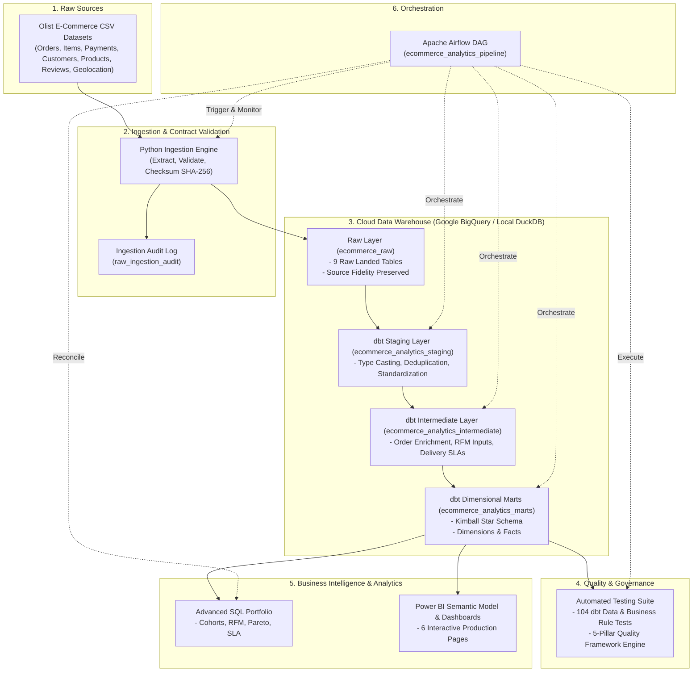

# System Architecture & Technical Design

## 1. High-Level Architecture Topology

The **E-Commerce Analytics Platform** is structured as a decoupled, multi-layer ELT pipeline designed for enterprise scale, data governance, and analytics reproducibility.

---

## 2. Component Separation & Responsibilities

| Pipeline Stage | Technology | Core Responsibilities | Anti-Patterns Avoided |
| :--- | :--- | :--- | :--- |
| **Ingestion** | Python 3.11+, PyArrow, Pydantic | File discovery, cryptographic checksums (SHA-256), schema contract validation, loading to Raw layer, writing structured execution audits. | No transformation or business calculation inside ingestion scripts. |
| **Raw Storage** | Google BigQuery (`ecommerce_raw`) / DuckDB | Landing zone preserving exact source schema, handling semi-structured data, maintaining raw audit tables. | No views, cleaning, or premature column dropping in raw storage. |
| **Transformation** | dbt Core 1.11+ | Modular, testable SQL transformations across Staging, Intermediate, and Marts layers. Automated catalog documentation. | No unversioned ad-hoc SQL transforms in downstream BI tools. |
| **Quality** | dbt Test + Python Quality Engine | 104 data tests validating uniqueness, non-nullability, referential integrity, and business bounds (e.g. delivery date >= order date). | No silent failures or swallowed data exceptions. |
| **Orchestration** | Apache Airflow 2.8+ | Dependency management, scheduling, automatic retries with exponential backoff, pipeline observability, reconciliation task. | Airflow does not execute heavy data processing within worker memory. |
| **Analytics & BI** | BigQuery SQL, Power BI Desktop, DAX | Star schema consumption, 6 curated dashboard pages, explicit DAX measure repository. | No direct CSV connections; no implicit DAX aggregations. |

---

## 3. Physical Storage & Partitioning Strategy (BigQuery)

For production deployment in Google BigQuery:
1. **Partitioning**:
   - `fct_orders`: Partitioned by `DATE(order_purchase_timestamp)` (Monthly granularity). Limits query scan bytes when filtering by reporting period.
   - `fct_order_items`: Partitioned by `DATE(order_purchase_timestamp)`.
   - `fct_delivery`: Partitioned by `DATE(order_purchase_timestamp)`.
2. **Clustering**:
   - `fct_orders`: Clustered by `customer_unique_id`, `customer_state`.
   - `fct_order_items`: Clustered by `product_id`, `seller_id`.
   - `dim_customer`: Clustered by `rfm_segment`, `primary_customer_state`.
   - `dim_product`: Clustered by `product_category_name_english`.
   - `dim_seller`: Clustered by `seller_state`, `seller_revenue_tier`.

---

## 4. Local vs Production Parity

To ensure 100% reproducibility without forcing third-party evaluators to set up a paid Google Cloud account, the architecture supports dual-target execution:
- **Local Development Target (`dev`)**: Uses an embedded DuckDB columnar engine (`ecommerce_warehouse.duckdb`). Executes identical ANSI-compliant SQL, runs all dbt transformations, passes all 104 data tests, and exports compressed Parquet files for local Power BI exploration.
- **Production Target (`prod_bigquery`)**: Connects to Google Cloud BigQuery using Service Account authentication or OAuth, creating tables in `ecommerce_raw` and `ecommerce_analytics`.
