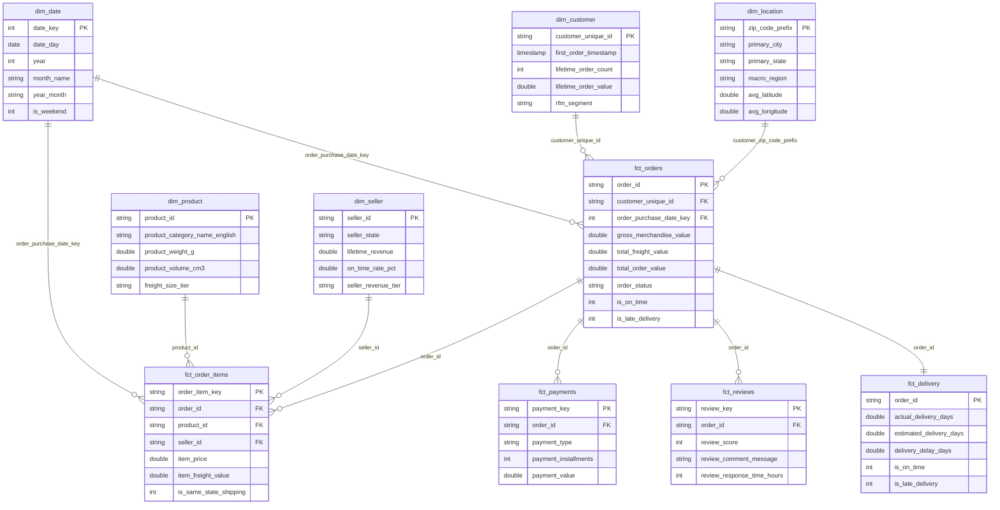

# Dimensional Data Model Specification

## 1. Dimensional Modeling Approach

The platform implements a **Kimball Star Schema** dimensional model. In contrast to 3NF transactional models (which prioritize insert performance and minimize redundancy at the expense of query complexity and joins), the dimensional star schema is optimized specifically for analytical queries, business metric aggregation, and BI dashboard responsiveness.

---

## 2. Fact Tables

### 2.1 `fct_orders`
* **Grain**: One row per customer order transaction (`order_id`).
* **Primary Key**: `order_id`
* **Foreign Keys**: `customer_unique_id`, `order_purchase_date_key`, `customer_zip_code_prefix`.
* **Business Purpose**: Core commercial transaction reporting. Contains consolidated order financial measures (GMV, freight, total order value), payment summaries, satisfaction ratings, and operational fulfillment flags.

### 2.2 `fct_order_items`
* **Grain**: One row per individual item line within an order (`order_item_key` = MD5 of `order_id` + `order_item_id`).
* **Primary Key**: `order_item_key`
* **Foreign Keys**: `order_id`, `product_id`, `seller_id`, `customer_id`, `order_purchase_date_key`.
* **Business Purpose**: Granular product-level analysis, pricing dynamics, unit volume, and seller-to-buyer shipping route dynamics.

### 2.3 `fct_payments`
* **Grain**: One row per payment instrument attempt (`payment_key` = MD5 of `order_id` + `payment_sequential`).
* **Primary Key**: `payment_key`
* **Foreign Keys**: `order_id`.
* **Business Purpose**: Tender analysis, payment installment behavior, voucher redemptions, and credit card share.

### 2.4 `fct_reviews`
* **Grain**: One row per customer review submission (`review_key` = MD5 of `review_id` + `order_id`).
* **Primary Key**: `review_key`
* **Foreign Keys**: `order_id`.
* **Business Purpose**: Customer satisfaction ratings (1-5), feedback sentiment analysis, and response latency.

### 2.5 `fct_delivery`
* **Grain**: One row per delivered order (`order_id`).
* **Primary Key**: `order_id`
* **Foreign Keys**: `customer_id`.
* **Business Purpose**: Operational supply chain analysis, carrier transit durations, promised SLA accuracy, and delivery delay tracking.

---

## 3. Dimension Tables

### 3.1 `dim_customer`
* **Grain**: One row per persistent unique human customer (`customer_unique_id`).
* **Primary Key**: `customer_unique_id`
* **Business Purpose**: Customer lifetime value, repeat buyer identification, RFM segmentation (Champions, Loyal, Recent, At Risk, Hibernating), and regional residence.

### 3.2 `dim_product`
* **Grain**: One row per unique catalog product (`product_id`).
* **Primary Key**: `product_id`
* **Business Purpose**: Product merchandising, English category classifications, physical dimensions, weight, and volumetric freight sizing tiers.

### 3.3 `dim_seller`
* **Grain**: One row per marketplace seller (`seller_id`).
* **Primary Key**: `seller_id`
* **Business Purpose**: Merchant scorecarding, lifetime revenue tiering (Enterprise, Growth, Established, Long Tail), on-time fulfillment rates, and customer review averages.

### 3.4 `dim_date`
* **Grain**: One row per calendar day.
* **Primary Key**: `date_key` (YYYYMMDD integer)
* **Business Purpose**: Time-series analytics, period-over-period comparisons (MoM, YoY), day-of-week seasonality, and calendar attributes.

### 3.5 `dim_location`
* **Grain**: One row per Brazilian 5-digit zip code prefix (`zip_code_prefix`).
* **Primary Key**: `zip_code_prefix`
* **Business Purpose**: Geographic spatial mapping, centroid latitude/longitude coordinates, state groupings, and official Brazilian IBGE macro-regions (Southeast, South, Northeast, Central-West, North).
