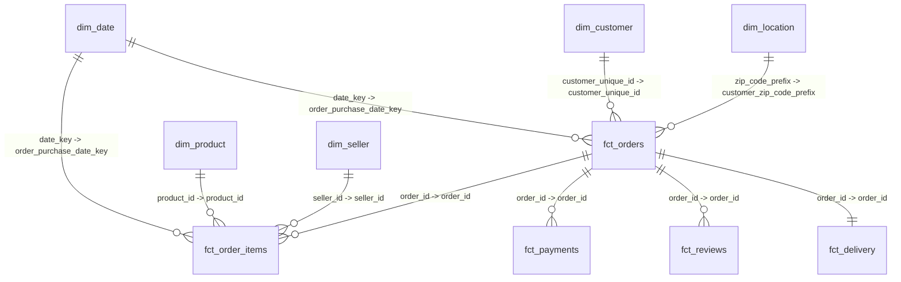

# Power BI Semantic Model Specification

## 1. Architecture Overview

The Power BI semantic model is built strictly on top of the curated dbt dimensional marts layer (`ecommerce_analytics_marts`). Raw CSV files are never connected directly to Power BI.

The model strictly adheres to Kimball Dimensional Modeling principles, establishing a **Star Schema** with one-to-many (`1:*`) relationships with **Single** cross-filter direction from dimensions to facts to guarantee optimal VertiPaq engine compression, eliminate ambiguity, and prevent circular relationships.

---

## 2. Table Catalog & Storage Modes

| Table Name | Layer Type | Storage Mode | Row Count | Primary Key | Description |
| :--- | :--- | :--- | :--- | :--- | :--- |
| `dim_date` | Dimension | Import | 1,461 | `date_key` | Marked as Date Table; calendar attributes 2016-2019. |
| `dim_customer` | Dimension | Import | 96,096 | `customer_unique_id` | Unique human customers with RFM scores and lifetime metrics. |
| `dim_product` | Dimension | Import | 32,951 | `product_id` | Product catalog with English categories and freight tiers. |
| `dim_seller` | Dimension | Import | 3,095 | `seller_id` | Seller profiles with SLA history and revenue tiers. |
| `dim_location` | Dimension | Import | 19,015 | `zip_code_prefix` | Brazilian zip code prefixes mapped to IBGE macro-regions. |
| `fct_orders` | Fact (Header) | Import | 99,441 | `order_id` | Order transactions with financial totals, delivery timestamps, and reviews. |
| `fct_order_items` | Fact (Line Item)| Import | 112,650 | `order_item_key` | Granular item sales, product prices, freight, and seller links. |
| `fct_payments` | Fact (Tender) | Import | 103,886 | `payment_key` | Payment transaction splits, installments, and payment methods. |
| `fct_reviews` | Fact (Feedback) | Import | 99,224 | `review_key` | Customer ratings (1-5), comments, and response latency. |
| `fct_delivery` | Fact (Operations)| Import | 96,478 | `order_id` | Delivered order fulfillment durations, carrier transit, and late SLA flags. |

---

## 3. Relationship Matrix

All relationships use **Single** cross-filter direction (dimension filters fact).

| Relationship ID | From Table (Dimension) | From Column | To Table (Fact) | To Column | Cardinality | Cross-Filter | Active |
| :--- | :--- | :--- | :--- | :--- | :--- | :--- | :--- |
| `REL-01` | `dim_date` | `date_key` | `fct_orders` | `order_purchase_date_key` | `1 : *` | Single | Yes |
| `REL-02` | `dim_date` | `date_key` | `fct_order_items` | `order_purchase_date_key` | `1 : *` | Single | Yes |
| `REL-03` | `dim_customer` | `customer_unique_id` | `fct_orders` | `customer_unique_id` | `1 : *` | Single | Yes |
| `REL-04` | `dim_product` | `product_id` | `fct_order_items` | `product_id` | `1 : *` | Single | Yes |
| `REL-05` | `dim_seller` | `seller_id` | `fct_order_items` | `seller_id` | `1 : *` | Single | Yes |
| `REL-06` | `dim_location` | `zip_code_prefix` | `fct_orders` | `customer_zip_code_prefix`| `1 : *` | Single | Yes |
| `REL-07` | `fct_orders` | `order_id` | `fct_order_items` | `order_id` | `1 : *` | Single | Yes |
| `REL-08` | `fct_orders` | `order_id` | `fct_payments` | `order_id` | `1 : *` | Single | Yes |
| `REL-09` | `fct_orders` | `order_id` | `fct_reviews` | `order_id` | `1 : *` | Single | Yes |
| `REL-10` | `fct_orders` | `order_id` | `fct_delivery` | `order_id` | `1 : 1` | Single | Yes |

---

## 4. Modeling Best Practices & Performance Optimization

1. **Mark as Date Table**: `dim_date` is designated as the official Date Table on column `date_day`, disabling Power BI's automatic hidden date hierarchies to conserve memory.
2. **Key Hiding**: Surrogate keys (`date_key`, `order_item_key`, `payment_key`, `review_key`) are hidden from the Report View canvas to guide self-service users exclusively towards explicit measures and descriptive attributes.
3. **No Bi-Directional Relationships**: By keeping relationships single-directional, row context transitions remain deterministic and prevent unexpected filter leakage across disparate fact tables.
4. **Column Categorization**:
   - `dim_location[primary_state]` categorized as **State or Province**.
   - `dim_location[primary_city]` categorized as **City**.
   - `dim_location[avg_latitude]` categorized as **Latitude**.
   - `dim_location[avg_longitude]` categorized as **Longitude**.
